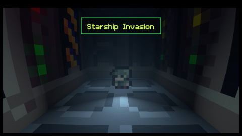
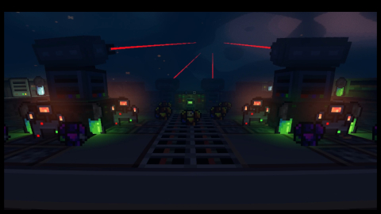
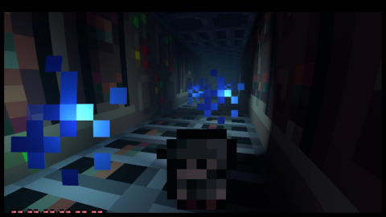
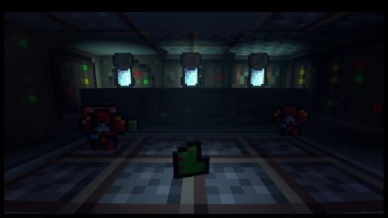
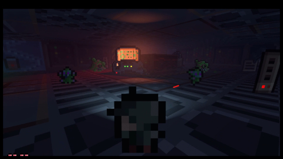
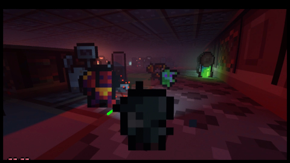

# Starship Invasion

## Screenshots








## Tools used

- [Godot 4.2.1](https://godotengine.org/)
- [Crocotile3D](https://crocotile3d.com/)
- [MagicaVoxel](https://ephtracy.github.io/)

## Project configs

### Maybe
- ammo reload option?
- space warrior: special of throwing grenade?

### Exporting
- maps scaled up to: 4x

### Movies
Converting mp4 -> ogv
```
SET clip=
ffmpeg -i %clip%.mp4 -q:v 10 -q:a 0 %clip%.ogv
```
